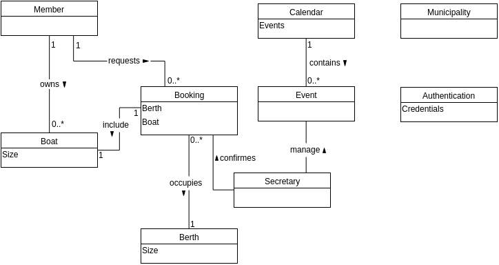

# 1dv607 Workshop 1 - Domain Modeling

## Submission 1 - Grade 2

Pär Eriksson (pe222gq) and Oskar Emilsson (oe222ca).

## Final submission - Grade 2

After getting the peer reviews, we decided to remove the association from Municipality, but keep it in the domain as it was a requirement and the municipality is an important part in the domain. We also keep the Authentication in the domain. In the real world it could simply be a door that requires a key.

We also removed the association between the Calendar and Booking, as that relationship does not need to persist. The Booking object remembers the booked boats and berths itself.

We understand that we could keep the number of associations even smaller, but given the small size of this particular domain we reasoned that they would add clarity to the domain model. In bigger domains one should keep the associations to a minimum, else it could clutter the model and make it harder to understand.

