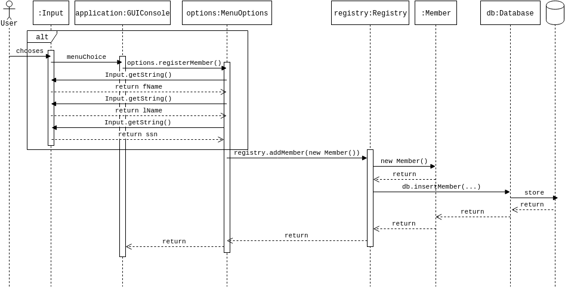

# Workshop 2 - Design

## Instructions

### Project structure

The `application` folder contains the source code for the application and the `release` folder contains the built application.

### Running the application

Download the files in the `release` folder or [this zip](MemberRegistry-1.1.tar.gz). Use a terminal or command prompt and navigate to where to stored/unzipped them and run the jar-file:

``` bash
$ java -jar MemberRegistry.jar
```

Enjoy!

## Grade 2 - Submission 1

### Diagrams

#### UML class diagram


#### Input Sequence diagrams - Register Member


#### Output Sequence diagrams - View Member


## Grade 2 - Final Submission

We decided...

### Diagrams


#### Input Sequence diagrams - Register Member



#### Output Sequence diagrams - View Member


